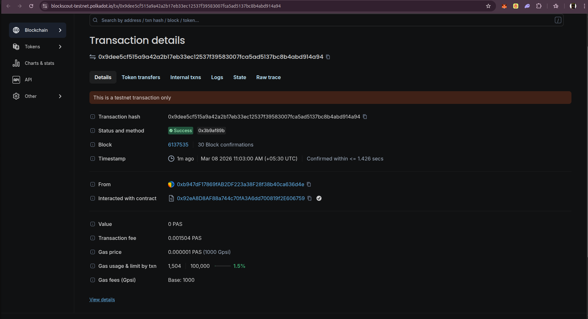

# DotLend
### The first money market on Polkadot Hub. Borrow HOLLAR against vDOT.

[](./LICENSE)
[](https://blockscout-testnet.polkadot.io)
[](https://dorahacks.io)

---

## What is DotLend?

DotLend is a lending protocol on Polkadot Hub. Users deposit **vDOT** (Bifrost's liquid staking token) as collateral and borrow **HOLLAR** (Hydration's stablecoin) against it.

> **DotLend is the first money market on Polkadot Hub where solvency is cryptographically proven, not assumed.**

**Why this matters:**
- vDOT has 76% utilization on Hydration's lending market — supply cap hit. Demand is proven.
- HOLLAR ($330M TVL) has zero native lending market outside Hydration's Omnipool.
- No money market exists on Polkadot Hub. DotLend is the first.
- Every 6 hours, a ZK proof verifies `total_collateral > total_debt` without revealing individual positions.

---

## Live on Polkadot Hub TestNet

Deployed March 8, 2026. All contracts verified on Blockscout.

| Contract | Address | Explorer |
|----------|---------|---------|
| PriceOracle | `0x92eA8D8AF88a744c70fA3A6dd700819f2E606759` | [view](https://blockscout-testnet.polkadot.io/address/0x92eA8D8AF88a744c70fA3A6dd700819f2E606759) |
| MockvDOT | `0x086Bd622eB3880f0eCCb8B86E0eB97f69b8dbD63` | [view](https://blockscout-testnet.polkadot.io/address/0x086Bd622eB3880f0eCCb8B86E0eB97f69b8dbD63) |
| MockHOLLAR | `0xe5a9ea3dDEFfD3fC4C98b6B338abC0930f34C727` | [view](https://blockscout-testnet.polkadot.io/address/0xe5a9ea3dDEFfD3fC4C98b6B338abC0930f34C727) |
| CollateralVault | `0xff58177D585b5dB022B0773405a40bEC443E512a` | [view](https://blockscout-testnet.polkadot.io/address/0xff58177D585b5dB022B0773405a40bEC443E512a) |
| LendingPool | `0xA8b36339C55c664BBe7C59d2d59Abf91f472C8d0` | [view](https://blockscout-testnet.polkadot.io/address/0xA8b36339C55c664BBe7C59d2d59Abf91f472C8d0) |

**Network:** Polkadot Hub TestNet | Chain ID `420420417` | [blockscout-testnet.polkadot.io](https://blockscout-testnet.polkadot.io)

---

## On-Chain Evidence

### Oracle price submission — live on Polkadot Hub TestNet



> **Tx:** [`0x9dee5cf5...914a94`](https://blockscout-testnet.polkadot.io/tx/0x9dee5cf515a9a42a2b17eb33ec12537f39583007fca5ad5137bc8b4abd914a94)
> **Status:** ✅ Success | **Block:** 6137535 | **Confirmed in:** ≤ 1.426s | **Mar 08 2026 11:03:00 AM**
> Oracle posted DOT price to `PriceOracle` contract — gas used: 1,504 / 100,000 (1.5%)

### Crisis simulation — price crash → liquidation

| Step | Result |
|------|--------|
| vDOT price before | $8.50 |
| vDOT price after crash | $6.00 |
| Health factor before | 1.214 (healthy) |
| Health factor after | 0.857 (liquidatable) |
| Debt repaid | $84 HOLLAR |
| vDOT seized by liquidator | 14.7 vDOT (5% bonus confirmed) |
| Debt remaining | $0.00 ✓ |

[Liquidation tx](https://blockscout-testnet.polkadot.io/tx/0xa09407bb1b8c41d265305de78ddb024144daeb0c47bfc62ff663bb7daf95c085)

---

## Protocol Parameters

| Parameter | Value |
|-----------|-------|
| Loan-to-Value (LTV) | 70% |
| Liquidation Threshold | 80% |
| Stability Fee | 0.5% / year (5 bps) |
| Liquidation Bonus | 5% |
| Oracle Stale Threshold | 1 hour |

---

## Setup

```bash
npm install --legacy-peer-deps
npm install -g pnpm   # required for resolc npm mode

# Compile (resolc for PolkaVM)
npx hardhat compile --network polkadotHubTestnet

# Test (62 tests, local hardhat)
npx hardhat test

# Deploy to Polkadot Hub TestNet
cp .env.example .env   # add PRIVATE_KEY
npx hardhat run scripts/deploy-protocol.js --network polkadotHubTestnet

# Run oracle
python3 -m venv oracle/.venv
oracle/.venv/bin/pip install -r oracle/requirements.txt
VDOT_PRICE_USD=8.50 oracle/.venv/bin/python3 oracle/oracle.py

# Crisis simulation
npx hardhat run scripts/simulate-crisis.js --network polkadotHubTestnet
```

---

## Architecture

```
User
 │
 ├─ deposit(vDOT) ──────────────────► CollateralVault
 │                                         │
 │                                    getHealthFactor()
 │                                         │
 ├─ borrow(HOLLAR) ─────────────────► LendingPool ◄──── PriceOracle
 │                                         │                  │
 │                                    accrueInterest()   submitPrice()
 │                                         │            (oracle.py / Hyperbridge ISMP)
 └─ liquidate(borrower) ────────────► LendingPool
                                           │
                                    vault.seizeCollateral(borrower, amount, liquidator)
                                           │
                                    vDOT → liquidator (direct, no pool hop)
```

**PolkaVM Safety:** No SELFDESTRUCT, CREATE2, EXTCODECOPY, assembly, or block.prevrandao anywhere.

---

## ZK Solvency Proof

DotLend generates a ZK proof every 6 hours proving the protocol is solvent without revealing individual positions.

**Circuit:** `circuits/solvency/src/main.nr` (Noir 1.0.0-beta.19, UltraHonk)

**Public inputs:** `total_collateral_value`, `total_debt`, `oracle_timestamp`

**Private inputs:** individual `(collateral_value, debt)` per user — hidden from verifier

**Constraint:** `sum(collateral_i) > sum(debt_i)` — cryptographically enforced

```bash
# Compile circuit
cd circuits/solvency && nargo compile

# Generate and submit proof (reads on-chain positions)
npx hardhat run scripts/generate-solvency-proof.js --network polkadotHubTestnet
```

The `SolvencyProven(totalCollateral, totalDebt, timestamp)` event is emitted on-chain with every successful proof. The Railway cron job submits automatically every 6 hours.

---

## Tests

```
npx hardhat test
```

76 tests, 0 failures across:
- `PriceOracle.test.js` — access control, staleness, price submission
- `CollateralVault.test.js` — deposit, withdraw, health factor math
- `LendingPool.test.js` — borrow, repay, liquidate, interest accrual
- `Integration.test.js` — full deposit→borrow→price crash→liquidate flow
- `SolvencyProof.test.js` — ZK proof integration: valid/invalid/stale, permissionless, input validation

---

## Docs

- [PHASES.md](./PHASES.md) — project phases and done criteria
- [docs/ROADMAP.md](./docs/ROADMAP.md) — sprint milestones
- [docs/screenshots/](./docs/screenshots/) — on-chain evidence
- [docs/WHITEPAPER.md](./docs/WHITEPAPER.md) — mechanism and math *(Phase 5)*
- [docs/ARCHITECTURE.md](./docs/ARCHITECTURE.md) — contract diagrams *(Phase 5)*

---

## Hackathon

**Polkadot Solidity Hackathon 2026** — EVM Track — DeFi/Stablecoin-enabled dApps
Submission deadline: March 20, 2026 23:59
Demo Day: March 24–25, 2026

Built by **Orthonode Systems** — Arhant Barmate
