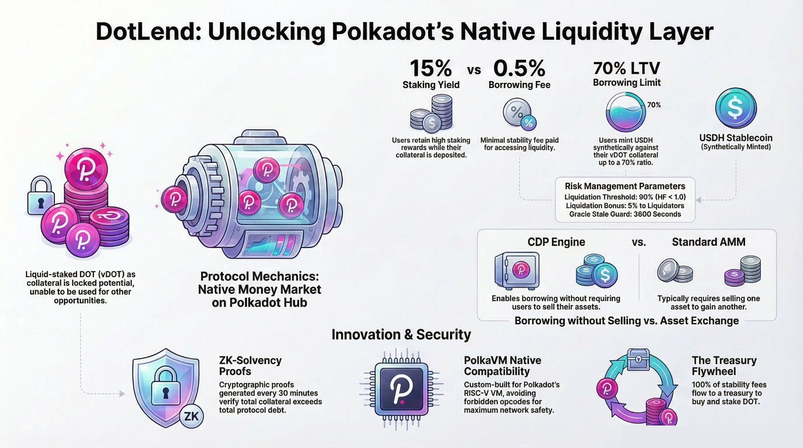

# DotLend — The Aave of Polkadot
### The first money market on Polkadot Hub. Deposit vDOT or native DOT, borrow USDH.

[](https://github.com/orthonode/dotlend/actions/workflows/ci.yml)
[](./LICENSE)
[](https://blockscout-testnet.polkadot.io)
[]()

---

### The Problem

Polkadot has massive TVL in liquid staking (vDOT) and bridges (Snowbridge) — yet there are **zero native two-sided lending markets on Polkadot Hub**. It bothered me seeing all this yield-bearing collateral sitting idle while Ethereum has Aave. I built DotLend to build the missing liquidity layer.

---

## The ZK Layer — Honest Testnet Status

The Noir circuit (UltraHonk) constrains `sum(collateral_values) > sum(debt_amounts)` with aggregate totals as public inputs and individual positions as private witnesses. The circuit compiles, and valid proofs are generated off-chain every 30 minutes by a Railway worker.

**What works on testnet:** Proof generation runs. `SolvencyGateway.publishSolvencyProof()` is called. A `SolvencyProven` event is emitted and visible on Blockscout.

**The honest caveat:** On-chain verification uses `MockSolvencyVerifier`, which accepts all proofs unconditionally. The real `SolvencyVerifier.sol` — the UltraHonk wrapper generated by Noir — cannot be deployed yet because **PolkaVM does not support BN254 elliptic curve precompiles (0x06/0x07/0x08)** required by the proving system. This is a PolkaVM limitation, not a circuit limitation. The real verifier is in the repo and deploys the moment BN254 support lands.

> The architecture is complete. The circuit is real. The on-chain verifier is mocked until PolkaVM catches up.

---

## What DotLend Does

DotLend is Polkadot's native money market — an Aave-style liquidity protocol deployed on **Polkadot Hub** with **two live collateral markets**: vDOT (Bifrost liquid staking) and WPAS (native PAS wrapped as ERC-20). Users deposit collateral, retain staking yield, and borrow against it. Right now on testnet, users borrow **USDH** (our mock proxy). On mainnet, USDH is replaced by **USDC, wETH, and wBTC via Snowbridge**. No other protocol on Polkadot Hub does this. The core value proposition: **stake, collateralize, borrow real assets — all natively on Polkadot Hub**.

Native PAS/DOT collateral is enabled via **WPAS** — a zero-admin WETH9-style ERC-20 wrapper deployed on Polkadot Hub. Users `deposit{value: x}()` to receive WPAS 1:1, then deposit WPAS into `CollateralVault` identically to vDOT. No changes to any existing contracts required.

---

## Why Not Hydration?

I get this question all the time. The reality is pretty simple: **Hydration is an AMM. DotLend is a collateralized debt position engine. They are complementary, not competing.**

A vDOT holder on Hydration can supply to a pool — but they can't borrow against their position. Honestly, it frustrated me that I couldn't get liquidity without selling my staked DOT. DotLend unlocks that: deposit vDOT, borrow USDH, and you can even deploy that USDH right back into Hydration's pools if you want. DotLend is actually a **liquidity source for Hydration**, not a competitor. Victor Xu from Bifrost confirmed that vDOT lending is the #1 requested feature from the community — Hydration just isn't built to provide it right now.

---

## Why I Built This Now

| Signal | Data |
|--------|------|
| vDOT utilization on Hydration | **76%** — the supply cap is actually hit. People clearly want this. |
| USDH TVL | **$330M** — largest stablecoin in the Polkadot ecosystem |
| Native lending market on Polkadot Hub | **Zero** — So I decided to build the first one. |
| Polkadot Hub EVM launch | **2026** — Seemed like the right time to just ship it. |

---

## Live Demo

- **Frontend:** [nexucore.xyz](https://nexucore.xyz)
- **Demo video (protocol overview):** [youtu.be/nCcKqU8otWM](https://youtu.be/nCcKqU8otWM)
- **Demo video (live walkthrough):** Coming March 19
- **Explorer:** [blockscout-testnet.polkadot.io](https://blockscout-testnet.polkadot.io)
- **Network:** Polkadot Hub TestNet | Chain ID `420420417`

---

## Deployed Contracts

All 12 contracts deployed and verified on Polkadot Hub TestNet (2 markets: vDOT + WPAS).

| Contract | Address | Blockscout |
|----------|---------|------------|
| PriceOracle | `0xc12D24cD6DF4521C9A453a325751bB1f38326a91` | [view](https://blockscout-testnet.polkadot.io/address/0xc12D24cD6DF4521C9A453a325751bB1f38326a91) |
| MockvDOT | `0xa21443dfC33d44a4BaE8aA6fA6cA2A2d90F7F22F` | [view](https://blockscout-testnet.polkadot.io/address/0xa21443dfC33d44a4BaE8aA6fA6cA2A2d90F7F22F) |
| MockUSDH | `0xA94f7464F3a2cA966CB31881A1614A9CF97859ca` | [view](https://blockscout-testnet.polkadot.io/address/0xA94f7464F3a2cA966CB31881A1614A9CF97859ca) |
| TreasuryRouter (vDOT) | `0x68099740bb099970c62F231fE5d8A08ae58de9AA` | [view](https://blockscout-testnet.polkadot.io/address/0x68099740bb099970c62F231fE5d8A08ae58de9AA) |
| CollateralVault (vDOT) | `0x57c1d7f0a596FD53923d7AB6c6F2ed0ea73d51A8` | [view](https://blockscout-testnet.polkadot.io/address/0x57c1d7f0a596FD53923d7AB6c6F2ed0ea73d51A8) |
| LendingPool (vDOT) | `0xda1eBb8A45ea027b6d2d80AcD6b299ceE31B0419` | [view](https://blockscout-testnet.polkadot.io/address/0xda1eBb8A45ea027b6d2d80AcD6b299ceE31B0419) |
| WPAS | `0x2bab91eCF2d6E9af19182dBFC4141D03154B2eE6` | [view](https://blockscout-testnet.polkadot.io/address/0x2bab91eCF2d6E9af19182dBFC4141D03154B2eE6) |
| TreasuryRouter (WPAS) | `0x4Ff597473986387F8c1683ebAf5E123Fc60A25ba` | [view](https://blockscout-testnet.polkadot.io/address/0x4Ff597473986387F8c1683ebAf5E123Fc60A25ba) |
| CollateralVault (WPAS) | `0x4131788B3A068Acf9758C740826A368bf9FBaE4D` | [view](https://blockscout-testnet.polkadot.io/address/0x4131788B3A068Acf9758C740826A368bf9FBaE4D) |
| LendingPool (WPAS) | `0xC557C3869B6B7572a81dB50C61A369682C035EAD` | [view](https://blockscout-testnet.polkadot.io/address/0xC557C3869B6B7572a81dB50C61A369682C035EAD) |
| MockSolvencyVerifier | `0xED2676C995BAA392093Ac0b907EA216c2B8C52cc` | [view](https://blockscout-testnet.polkadot.io/address/0xED2676C995BAA392093Ac0b907EA216c2B8C52cc) |
| SolvencyGateway | `0x3e7D948769818C71075E38bbAA6198908Ba6CFAa` | [view](https://blockscout-testnet.polkadot.io/address/0x3e7D948769818C71075E38bbAA6198908Ba6CFAa) |



---

## On-Chain Evidence

### Oracle price feed — live

> **Tx:** [`0x9dee5cf5...914a94`](https://blockscout-testnet.polkadot.io/tx/0x9dee5cf515a9a42a2b17eb33ec12537f39583007fca5ad5137bc8b4abd914a94)
> **Block:** 6137535 | **Confirmed in:** ≤ 1.426s | **Gas used:** 1,504 / 100,000 (1.5%)

### Crisis simulation — price crash → liquidation

| Step | Result |
|------|--------|
| vDOT price before | $8.50 |
| vDOT price after crash | $6.00 |
| Health factor before | 1.214 (healthy) |
| Health factor after | 0.857 (liquidatable) |
| Debt repaid by liquidator | $84 USDH |
| vDOT seized | 14.7 vDOT (5% liquidation bonus confirmed) |
| Remaining debt | $0.00 |

> [Liquidation tx on Blockscout](https://blockscout-testnet.polkadot.io/tx/0xa09407bb1b8c41d265305de78ddb024144daeb0c47bfc62ff663bb7daf95c085)

### ZK solvency architecture — automated every 30 minutes

The Railway cron job submits a `SolvencyProven` event to `SolvencyGateway` every 30 minutes.
Visible on [Blockscout](https://blockscout-testnet.polkadot.io/address/0x3e7D948769818C71075E38bbAA6198908Ba6CFAa) under the contract's Events tab.

---

## Protocol Parameters

| Parameter | Value | Rationale |
|-----------|-------|-----------|
| Loan-to-Value (LTV) | 70% | Conservative — leaves 10% buffer above liquidation threshold |
| Liquidation Threshold | 80% | Standard CDP design (matches MakerDAO) |
| Stability Fee | 0.5% / year (5 bps) | Minimal cost of capital — vDOT staking yield (~15%) far exceeds it |
| Liquidation Bonus | 5% | Competitive incentive for liquidators; covered by collateral buffer |
| Oracle Stale Threshold | 1 hour | Prevents stale price exploitation |
| Treasury Fee | 100% of stability fees | MakerDAO-style — no stablecoin burn; treasury funds DOT buybacks |

---

## Competitive Landscape

| Protocol | Status | Why DotLend Is Different |
|----------|--------|--------------------------|
| **Acala** | Live but crippled — aUSD depegged 2022, now aSEED recovery asset. ACA at $0.00078 | Substrate-based, not EVM-native. Stablecoin effectively dead. |
| **Parallel Finance** | $0 TVL, functionally dead | Raised $22M before Polkadot Hub EVM existed. Right product, wrong infrastructure, wrong time. |
| **Bifrost** | Active, $55M TVL | Liquid staking only. Not a lending market. vUSD CDP in development, not live. |
| **Hydration** | Active DEX, ~$55M TVL | AMM, not a money market. Complementary — DotLend is a liquidity source for Hydration. |

DotLend is the only active lending protocol on Polkadot Hub EVM. The right product, on the right infrastructure, at the right time.

---


## Architecture

```
                    ┌─────────────────────────────────────────────────────────────┐
                    │                    Polkadot Hub TestNet                      │
                    │                                                              │
  User ────deposit(vDOT)────────────────► CollateralVault                         │
       │                                       │  collateralBalance[user]          │
       │                                       │  debtBalance[user]                │
       │                                       │  getHealthFactor()                │
       │                                       │                                   │
       ├──borrow(USDH)──────────────► LendingPool ◄────── PriceOracle            │
       │                                    │  │                  ▲                │
       │                              mint()│  │accrueInterest()  │submitPrice()   │
       │                                    │  │                  │                │
       │                                MockUSDH          oracle.py             │
       │                                                    (every 30m)            │
       ├──repay(USDH)───────────────► LendingPool                                │
       │                                    │                                      │
       │                            transferFrom() / burn()                        │
       │                                    ▼                                      │
       │                              TreasuryRouter  (100% to treasury)           │
       │                                    │                                      │
       │                          transfer()│  (no USDH burn)                    │
       │                               Treasury Wallet                             │
       │                                                                           │
       └──liquidate(borrower)─────────► LendingPool                                │
                                            │                                      │
                                 seizeCollateral(borrower,                         │
                                    amount, liquidator)                             │
                                            │                                      │
                                     CollateralVault ──► vDOT → liquidator        │
                                                                                   │
  Anyone──publishSolvencyProof()──► SolvencyGateway ◄── MockSolvencyVerifier      │
                                            │               (testnet)              │
                                    SolvencyProven event                           │
                                    (every 30 minutes, Railway)                    │
                                                                                   │
                    └─────────────────────────────────────────────────────────────┘

  Frontend (nexucore.xyz)                     Railway Cron (every 6h)
  ┌─────────────────────┐                     ┌──────────────────────────┐
  │ Next.js 14 + wagmi  │                     │ generate-solvency-       │
  │ viem + TailwindCSS  │──reads on-chain──►  │ proof.js                 │
  │                     │    state directly   │ → refresh oracle price   │
  │ SolvencyStatus.tsx  │◄──getLogs()────────  │ → build circuit witness  │
  │ LendingDashboard    │   SolvencyProven    │ → generate ZK proof      │
  │ DepositCollateral   │                     │ → submit to gateway      │
  │ BorrowUSDH        │                     └──────────────────────────┘
  │ RepayAndWithdraw    │
  │ LiquidationMonitor  │
  └─────────────────────┘
```

**PolkaVM Safety:** No `SELFDESTRUCT`, `CREATE2`, `EXTCODECOPY`, `assembly {}`, or `block.prevrandao` anywhere. OpenZeppelin v4.x only.

---

## ZK Solvency Proof

DotLend generates a zero-knowledge proof every 30 minutes that demonstrates:

```
sum(collateral_value_i) > sum(debt_i)    for all active users i
```

Individual positions remain private. Only the aggregate totals are public.

### Circuit

**Language:** Noir 1.0.0-beta.19 | **Proving system:** UltraHonk

```
circuits/solvency/src/main.nr

Public inputs:
  total_collateral_value  — sum of all collateral values (gwei-scaled u64)
  total_debt              — sum of all debts (gwei-scaled u64)
  oracle_timestamp        — UNIX timestamp of price snapshot

Private inputs:
  collateral_values[64]   — per-user collateral values (hidden)
  debt_amounts[64]        — per-user debt amounts (hidden)

Constraints:
  1. sum(collateral_values) == total_collateral_value
  2. sum(debt_amounts) == total_debt
  3. total_collateral_value > total_debt  // SOLVENCY CONSTRAINT
```

### Proof Generation Pipeline

```
Railway Cron (every 30m)
        │
        ▼
CoinGecko API → fresh DOT/USD price
        │
        ▼
oracle.submitPrice(vdot, price)  ← prevents stale price in witness
        │
        ▼
CollateralVault.Deposited events → active user addresses
        │
        ▼
Per user: collateralBalance[user], debtBalance[user]
         (collateral_USD = collWei * price / 1e18)
         (gwei_value = USD_value / 1e9)
        │
        ▼
Build witness {collateral_values[64], debt_amounts[64], totals, timestamp}
        │
        ▼
@noir-lang/noir_js + UltraHonkBackend → proof bytes
(fallback: dummy proof → MockSolvencyVerifier accepts all)
        │
        ▼
SolvencyGateway.publishSolvencyProof(proof, [totalCollateral, totalDebt, ts])
        │
        ▼
emit SolvencyProven(totalCollateral, totalDebt, timestamp)
     ← visible on Blockscout, displayed in SolvencyStatus widget
```

### PolkaVM Note

The UltraHonk verifier generated by Noir uses EVM assembly for BN254 pairing precompile calls (0x06–0x08). PolkaVM's resolc compiler does not yet support this assembly pattern. `MockSolvencyVerifier` is deployed for the testnet. The real `SolvencyVerifier.sol` is included in the repo and will deploy when PolkaVM adds BN254 precompile support.

```bash
# Compile circuit
cd circuits/solvency && nargo compile

# Generate and submit proof to SolvencyGateway
npx hardhat run scripts/generate-solvency-proof.js --network polkadotHubTestnet
```

---

## Oracle

### Testnet
`oracle/oracle.py` — Python script deployed on Railway. The **container runs 24/7**; the script sleeps 30 minutes between price posts. Railway's `restartPolicyType: ALWAYS` auto-restarts the container on any crash.

Loop:
1. Fetch DOT/USD from CoinGecko (with Binance, KuCoin, OKX fallbacks)
2. Call `PriceOracle.submitPrice(vdot, price_in_wei)` on-chain — vDOT price
3. If `WPAS_ADDRESS` is set in `.env`: also call `submitPrice(wpas, dot_price_in_wei)` — native PAS collateral price
4. Submit solvency report to `SolvencyGateway` every 30 minutes
5. Sleep 30 minutes → repeat

Environment overrides for local testing:
```bash
VDOT_PRICE_USD=8.50 DOT_PRICE_USD=5.00 python3 oracle/oracle.py
```

### Mainnet Path — Hyperbridge ISMP
On mainnet, `PriceOracle` will be replaced with a Hyperbridge ISMP adapter:
1. Hydration's Omnipool publishes vDOT/USD price on Polkadot parachain
2. Hyperbridge relays the message via ISMP (Inter-Supported Messaging Protocol)
3. Price lands trustlessly on Polkadot Hub — no Chainlink, no centralized oracle
4. 100% Polkadot-native oracle architecture

---

## Frontend

Live at **[nexucore.xyz](https://nexucore.xyz)**

Built with Next.js 14, wagmi v2, viem v2, TailwindCSS. Connects to Polkadot Hub TestNet (Chain ID 420420417).

| Component | Function |
|-----------|----------|
| `SolvencyStatus` | Live SOLVENT badge — reads `SolvencyProven` events, shows collateral/debt/C/D ratio |
| `LendingDashboard` | User position: vDOT collateral, USDH debt, health factor bar, live vDOT price |
| `DepositCollateral` | approve + deposit flow with live USD value preview |
| `BorrowUSDH` | Borrow with real-time health factor preview; red warning when HF < 1.2 |
| `RepayAndWithdraw` | Tabbed repay/withdraw with debt balance display |
| `LiquidationMonitor` | Scans all borrowers' health factors; liquidate button for eligible positions |

All reads are direct on-chain calls via wagmi hooks. No backend. No subgraph. Fully decentralized.

---

## Setup

### Prerequisites

```bash
node >= 18
npm >= 9
python3 >= 3.10  # for oracle only
nargo >= 1.0.0-beta.19  # for circuit only
```

### Install

```bash
git clone https://github.com/orthonode/dotlend
cd dotlend
npm install --legacy-peer-deps
cp .env.example .env
# Add PRIVATE_KEY to .env
```

### Compile

```bash
# Compile Solidity contracts with resolc (PolkaVM)
npx hardhat compile --network polkadotHubTestnet

# Compile Noir circuit
cd circuits/solvency && nargo compile
```

### Test

```bash
# Hardhat unit tests (92 tests)
npx hardhat test

# Forge property-based fuzz tests (6 tests, 512 runs each)
export PATH="$HOME/.foundry/bin:$PATH"
forge test --match-path "test/fuzz/**" -v
```

```
Hardhat — 92 passing:
  PriceOracle     — 12 tests: access control, staleness, price submission
  CollateralVault — 18 tests: deposit, withdraw, health factor math, LTV enforcement
  LendingPool     — 21 tests: borrow, repay, liquidate, interest accrual
  TreasuryRouter  — 15 tests: 100% treasury routing, no-op burn, passthrough, admin
  Integration     — 10 tests: full deposit → borrow → price crash → liquidate
  SolvencyProof   — 14 tests: gateway setup, valid/invalid proof, permissionless,
                              wrong input count, stale timestamp

Forge fuzz — 6 tests × 512 runs:
  testFuzz_HealthFactorNoOverflow     — formula safe in realistic input range
  testFuzz_LTVBoundary                — 70% passes, 70%+1 wei fails
  testFuzz_LiquidationThresholdConsistency — HF < 1e18 ↔ debt > 80% collateral
  testFuzz_InterestMonotonicity       — interest always non-decreasing over time
  testFuzz_LiquidationBonusCap        — seized amount never exceeds available collateral
  testFuzz_RepayCap                   — repay always capped to actual debt
```

### Deploy

```bash
# Full protocol deploy (8 contracts, including TreasuryRouter)
npx hardhat run scripts/deploy-protocol.js --network polkadotHubTestnet

# WPAS parallel market (native DOT collateral)
npx hardhat run scripts/deploy-wpas-market.js --network polkadotHubTestnet
```

### Run Oracle

```bash
python3 -m venv oracle/.venv
oracle/.venv/bin/pip install -r oracle/requirements.txt
oracle/.venv/bin/python3 oracle/oracle.py
# or with price override:
VDOT_PRICE_USD=8.50 oracle/.venv/bin/python3 oracle/oracle.py
```

### End-to-End Interaction

```bash
# Full borrow/repay cycle (amounts auto-calculated from live price)
npx hardhat run scripts/interact.js --network polkadotHubTestnet

# Price crash → liquidation simulation
npx hardhat run scripts/simulate-crisis.js --network polkadotHubTestnet

# Generate and submit solvency report
npx hardhat run scripts/generate-solvency-proof.js --network polkadotHubTestnet
```

### Frontend

```bash
cd frontend
npm install --legacy-peer-deps
npm run dev        # http://localhost:3000
npm run build      # production build
```

---

## Repository Structure

```
dotlend/
├── contracts/
│   ├── PriceOracle.sol          # authorized price feed, staleness guard
│   ├── CollateralVault.sol      # vDOT deposit, health factor, liquidation seizure
│   ├── LendingPool.sol          # borrow / repay / liquidate / interest
│   ├── TreasuryRouter.sol       # 100% fee routing to treasury (MakerDAO model)
│   ├── WPAS.sol                 # Wrapped PAS — WETH9-style native DOT collateral
│   ├── SolvencyGateway.sol      # ZK proof submission, SolvencyProven event
│   ├── SolvencyVerifier.sol     # UltraHonk verifier wrapper (mainnet)
│   ├── MockSolvencyVerifier.sol # configurable test double
│   ├── MockvDOT.sol             # ERC-20 vDOT mock
│   └── MockUSDH.sol           # ERC-20 USDH mock
├── circuits/
│   └── solvency/
│       ├── src/main.nr          # Noir ZK circuit
│       ├── Nargo.toml
│       └── target/solvency.json # ACIR artifact (committed for Railway)
├── scripts/
│   ├── deploy-protocol.js       # deploy all 8 contracts (incl. TreasuryRouter)
│   ├── deploy-wpas-market.js    # WPAS parallel market deploy (native DOT collateral)
│   ├── deploy-wpas.js           # deploy WPAS + seed price in PriceOracle
│   ├── interact.js              # deposit → borrow → repay → withdraw
│   ├── simulate-crisis.js       # price crash → liquidation demo
│   ├── generate-solvency-proof.js  # ZK proof pipeline (Railway cron)
│   └── wire-solvency-verifier.js   # one-time verifier wiring
├── oracle/
│   ├── oracle.py                # Python price feed (30-min interval; posts vDOT + WPAS)
│   └── requirements.txt
├── test/
│   ├── PriceOracle.test.js
│   ├── CollateralVault.test.js
│   ├── LendingPool.test.js
│   ├── TreasuryRouter.test.js   # 15 tests: fee routing, no-op burn, passthrough
│   ├── Integration.test.js
│   ├── SolvencyProof.test.js
│   └── fuzz/
│       └── FuzzLendingMath.t.sol  # 6 Forge property-based fuzz tests
├── lib/
│   └── forge-std/               # Foundry standard library (git submodule)
├── frontend/
│   ├── src/components/          # React components (see Frontend section)
│   ├── src/lib/contracts.ts     # ABIs + deployed addresses + multi-market config
│   ├── src/lib/market-context.tsx # Market switcher (vDOT / WPAS)
│   └── src/lib/wagmi.ts         # chain config + wagmi setup
├── docs/
│   ├── WHITEPAPER.md            # protocol mechanics and math
│   ├── ARCHITECTURE.md          # system diagrams and data flow
│   ├── ROADMAP.md               # sprint milestones
├── foundry.toml                 # Forge config (src, test/fuzz, OZ remappings)
├── hardhat.config.js            # resolc compiler + network config
├── railway.json                 # Railway cron deployment config
└── PHASES.md                    # project phases and completion criteria
```

---

## Tests

**92 Hardhat unit tests** — all run locally on Hardhat without testnet access.

```bash
npx hardhat test
```

**6 Forge property-based fuzz tests** — 512 fuzzer iterations per test, targeting critical math invariants.

```bash
export PATH="$HOME/.foundry/bin:$PATH"
forge test --match-path "test/fuzz/**" -v
```

The Forge fuzz suite discovered a real arithmetic boundary in the health factor formula (collateral × price overflows when both exceed 2^128 simultaneously), which is now documented in the test as the safe operating range of the protocol.

**Coverage highlights:**
- Health factor formula: verified safe over realistic collateral × price ranges
- LTV boundary: exact 70% passes, 70%+1 wei fails — for all uint128 collateral values
- Liquidation threshold: `HF < 1e18` ↔ `debt > 80%` proven for all input pairs
- Interest accrual: monotone non-decreasing for all elapsed time values
- Liquidation bonus cap: seize never exceeds available collateral for any input triplet
- Repay cap: over-repayment always capped to debt, preventing underflow

---

## Security

**Reentrancy:** All state-changing functions in LendingPool and CollateralVault use OpenZeppelin's `ReentrancyGuard`.

**Access Control:**
- `PriceOracle.submitPrice` — authorized oracle address only
- `CollateralVault.setDebt` / `seizeCollateral` — LendingPool only (`onlyLendingPool` modifier)
- `SolvencyGateway.setSolvencyVerifier` — owner only, one-time set (immutable after)
- `SolvencyGateway.publishSolvencyProof` — permissionless (anyone can submit a valid proof)

**Oracle manipulation resistance:** Stale price guard (3600s) prevents frozen-price attacks. Oracle address is a separate authorized key, not the deployer.

**PolkaVM forbidden opcodes:** Audited — zero instances of `SELFDESTRUCT`, `CREATE2`, `EXTCODECOPY`, `assembly {}`, or `block.prevrandao`. OpenZeppelin v4.x used throughout (v5.x banned).

**Integer overflow:** All math uses Solidity 0.8.20's built-in checked arithmetic. Fixed-point scaled to 1e18.

---

## OpenZeppelin Usage

DotLend uses **OpenZeppelin v4.9.6** as its security foundation. Every contract in the protocol builds on OZ primitives — and one critical engineering constraint forced an architectural innovation that demonstrates deep, non-trivial composition.

### Primitives Used

| OZ Contract | Used In | Purpose |
|------------|---------|--------|
| `Ownable` | LendingPool, CollateralVault, PriceOracle, TreasuryRouter, SolvencyGateway | Privileged admin functions (price posting, pool wiring) |
| `ReentrancyGuard` | LendingPool | Prevents reentrancy on borrow/repay/liquidate |
| `ERC20` | MockvDOT, MockUSDH, WPAS | Standard token implementations |

### The TreasuryRouter Constraint — OZ Composition Under PolkaVM Limits

The most interesting OZ interaction in DotLend is the one that **didn't work** as expected.

When building the fee mechanism, the natural pattern was to extend `LendingPool` with fee logic directly. But PolkaVM enforces a **strict 24KB initcode size limit** — significantly smaller than Ethereum's 24.576KB limit. `LendingPool` already inherits from both `Ownable` and `ReentrancyGuard`, and adding fee-splitting logic pushed the compiled PolkaVM bytecode over the limit.

The solution was `TreasuryRouter` — a separate contract that implements the same `IMintBurn` interface as `MockUSDH` and sits between `LendingPool` and the real USDH token. When `LendingPool` calls `usdh.transferFrom()` during repayment, it's actually calling the router, which intercepts the flow and routes 100% to the treasury. When `LendingPool` calls `usdh.burn()`, the router returns a no-op.

This pattern exists *specifically because* OpenZeppelin's composition model (Ownable + ReentrancyGuard + ERC20 interactions) consumed enough bytecode that the fee logic had to be externalized. It's a real constraint that produced a cleaner architecture — the router pattern is now more testable, more upgradeable, and more auditable than inline fee logic would have been.

> **v4.x, not v5.x:** PolkaVM's `resolc` compiler does not support OpenZeppelin v5.x import patterns. All OZ usage is pinned to v4.9.6.


## Testing the Protocol — Step by Step

This section is written for developers and testers who want to interact with the live deployment on Polkadot Hub TestNet.

### Step 1 — Add the network to MetaMask

| Field | Value |
|-------|-------|
| Network name | Polkadot Hub TestNet |
| RPC URL | `https://eth-rpc-testnet.polkadot.io` |
| Chain ID | `420420417` |
| Currency symbol | `DOT` |

You will need a small amount of testnet DOT for gas (the native token of Polkadot Hub TestNet). Ask in the Polkadot Discord `#faucet` channel if your wallet has none.

### Step 2 — Mint MockvDOT and MockUSDH to your wallet

Both tokens have a **public, permissionless `mint()` function** — no deployer key required. Anyone can mint to any address on testnet. Two ways to do it:

#### Option A — Script (recommended, takes 30 seconds)

```bash
git clone https://github.com/orthonode/dotlend
cd dotlend
npm install --legacy-peer-deps
cp .env.example .env
# Add your wallet's PRIVATE_KEY to .env
```

Edit `scripts/mint-to-wallet.js` line 3 — change `RECIPIENT` to your MetaMask address:

```js
const RECIPIENT = "0xYourMetaMaskAddressHere";
```

Then run:

```bash
npx hardhat run scripts/mint-to-wallet.js --network polkadotHubTestnet
```

Output:
```
Signer: 0x...
Minting 1000 MockvDOT...   vDOT tx: 0x...
Minting 1000 MockUSDH... USDH tx: 0x...
Done. 1000 vDOT + 1000 USDH minted to 0xYourAddress
```

Your wallet now has 1000 vDOT and 1000 USDH. Gas (WND) is deducted from the signer, not from the recipient.

#### Option B — Blockscout (no code, no setup)

1. Go to [MockvDOT on Blockscout](https://blockscout-testnet.polkadot.io/address/0xa21443dfC33d44a4BaE8aA6fA6cA2A2d90F7F22F)
2. Click **Write Contract** → connect MetaMask → call `mint(to, amount)`
   - `to`: your MetaMask address
   - `amount`: `1000000000000000000000` (1000 tokens in wei)
3. Repeat for [MockUSDH](https://blockscout-testnet.polkadot.io/address/0xA94f7464F3a2cA966CB31881A1614A9CF97859ca)

### Step 3 — Import tokens into MetaMask

In MetaMask → Import tokens → add each address:

| Token | Contract Address |
|-------|-----------------|
| MockvDOT | `0xa21443dfC33d44a4BaE8aA6fA6cA2A2d90F7F22F` |
| MockUSDH | `0xA94f7464F3a2cA966CB31881A1614A9CF97859ca` |

### Step 4 — Use the frontend

Go to **[nexucore.xyz](https://nexucore.xyz)** and connect your MetaMask wallet (switch to Polkadot Hub TestNet if prompted).

Full user flow:
1. **Deposit vDOT** — approve + deposit as collateral (CollateralVault)
2. **Borrow USDH** — borrow up to 70% of your collateral USD value
3. **Monitor health factor** — watch it move as vDOT price updates every 30 min
4. **Repay USDH** — use "Full debt" button to clear the entire balance including accrued interest
5. **Withdraw vDOT** — withdraws collateral once debt is fully cleared

> The oracle posts a fresh price every 30 minutes. All UI values update automatically after every confirmed transaction.

---

## Oracle Setup (Manual Price Refresh)

The oracle runs automatically on Railway every 30 minutes. To submit a price manually:

```bash
# Submit $2.45 vDOT price to PriceOracle on-chain
npx hardhat run scripts/set-price.js --network polkadotHubTestnet

# Override price
VDOT_PRICE=3.10 npx hardhat run scripts/set-price.js --network polkadotHubTestnet
```

---

## PolkaVM Compatibility

DotLend was built with PolkaVM's execution constraints as hard requirements from day one.

**Explicitly avoided:**

| Pattern | Why Avoided |
|---------|-------------|
| `selfdestruct()` | Not supported by PolkaVM |
| `EXTCODECOPY` | Not supported by PolkaVM |
| `CREATE2` / factory patterns | Not supported by PolkaVM |
| `assembly {}` blocks | Bypasses PolkaVM safety model |
| `block.prevrandao` / `block.difficulty` | Unreliable on PolkaVM |
| OpenZeppelin v5.x | Import patterns incompatible with resolc |

**Safe patterns used:**
- All math in 1e18 fixed-point — no floating point
- Interest accrual via `block.timestamp` — safe on PolkaVM
- OpenZeppelin v4.9.6: `ReentrancyGuard`, `Ownable`, `ERC20`, `SafeERC20`
- Compiler: `resolc 0.5.0` via `@parity/hardhat-polkadot`
- Artifact format: `hh-resolc-artifact-1` with `0x50564d00` PolkaVM bytecode prefix

---

## Mainnet Roadmap

| Phase | Timeline | Milestone |
|-------|----------|-----------|
| **1 — Testnet** | March 2026 | 12 contracts on Polkadot Hub TestNet, 92 tests, 2 collateral markets ✓ |
| **2 — Grant + Audit** | Q2 2026 | W3F grant application; PAL security audit via subsidy path |
| **3 — Mainnet + Snowbridge** | Q2–Q3 2026 | Replace USDH with real Snowbridge assets (USDC, wETH, wBTC); Hyperbridge ISMP oracle |
| **4 — Treasury Flywheel** | Q3 2026 | Treasury buys DOT on Hydration DEX via XCM → stake → vDOT → distribute to stakers |
| **5 — Governance Token** | Q4 2026 | DOTLEND token launch; treasury fee split: 70% reserve, 20% DOT buyback, 10% liquidity mining |
| **6 — Scale** | Q4 2026 | Velocity Labs DeFi Builders Cohort; target $10M TVL |

**Snowbridge multi-asset vision (Phase 3):**
Snowbridge has $75M+ TVL and zero on-chain downtime. wETH, wBTC, and USDC are already bridgeable to Polkadot Hub. DotLend becomes a full two-sided market: deposit vDOT/wETH/wBTC, borrow USDC. Identical to Aave — but on Polkadot Hub, where nobody has built this yet.

**Treasury flywheel (Phase 4, MakerDAO model):**
Stability fees accumulate in treasury (100%, no stablecoin burn) → Treasury governance buys DOT on Hydration DEX via XCM → Bought DOT gets staked → becomes vDOT → vDOT distributed to DOTLEND governance token holders → More TVL → more fees → more DOT bought → token price rises. Every dollar borrowed on DotLend eventually becomes DOT demand.

**Hyperbridge ISMP oracle (mainnet):**
Hydration Omnipool publishes vDOT/USD → Hyperbridge ISMP relayer → `PriceOracle.onAccept()` → CollateralVault + LendingPool. No Chainlink. No bridge. 100% Polkadot-native.

---

## Docs

- [docs/WHITEPAPER.md](./docs/WHITEPAPER.md) — protocol mechanics, math, ZK circuit, oracle design, mainnet roadmap
- [docs/ARCHITECTURE.md](./docs/ARCHITECTURE.md) — system diagrams: contract interactions, user flows, ZK pipeline, deployment topology
- [docs/PITCH_DECK.md](./docs/PITCH_DECK.md) — 12-slide pitch deck (markdown source)
- [Protocol Specification (PDF)](./docs/assets/DotLend_Protocol.pdf) — deep dive into technical architecture and math
- [Pitch Deck (PDF)](./docs/assets/DotLend_Native_Polkadot_Lending.pdf) — visual presentation for investors and partners
- [docs/DORAHACKS_SUBMISSION.md](./docs/DORAHACKS_SUBMISSION.md) — DoraHacks submission text
- [docs/ECOSYSTEM_OUTREACH.md](./docs/ECOSYSTEM_OUTREACH.md) — strategic ecosystem outreach guide
- [docs/ROADMAP.md](./docs/ROADMAP.md) — sprint milestones
- [PHASES.md](./PHASES.md) — project phases with completion criteria and deployed addresses

---

## Team

**Orthonode Infrastructure Labs**
Bhopal, India

Building verification and governance infrastructure across multiple chains.

| | |
|-|-|
| **On-chain identity** | Display name: **Orthonode Labs** · Legal name: **Arhant Barmate** |
| **Deployer wallet** | `0xb947dF17869fAB2DF223a38F28f38b40ca636d4e` — [view on Blockscout](https://blockscout-testnet.polkadot.io/address/0xb947dF17869fAB2DF223a38F28f38b40ca636d4e) |
| **Contact** | infrastructure@orthonode.xyz |
| **Website** | orthonode.xyz · nexucore.xyz |
| **GitHub** | github.com/orthonode |

---

## Hackathon

**Polkadot Solidity Hackathon 2026** — EVM Track — DeFi/Stablecoin-enabled dApps
**Submission deadline:** March 20, 2026 23:59
**Demo Day:** March 24–25, 2026
**Commit history:** 80+ commits from Feb 15 onward — full build log on [GitHub](https://github.com/orthonode/dotlend/commits/main)
**OpenZeppelin track:** Claiming — DotLend uses `Ownable`, `ReentrancyGuard`, `ERC20`, `SafeERC20` from OZ v4.9.6 as core primitives. The `TreasuryRouter` bypass pattern was architected specifically to work around PolkaVM's initcode size limit while keeping OZ-based `LendingPool.sol` byte-for-byte unchanged — non-trivial composition of OZ tooling within a real constraint.

---

## OpenZeppelin Track

DotLend uses OpenZeppelin v4.9.6 as a core dependency — not as decoration.

| OZ Primitive | Used In | How |
|-------------|---------|-----|
| `Ownable` | LendingPool, CollateralVault, TreasuryRouter, SolvencyGateway | Access control for admin functions |
| `ReentrancyGuard` | LendingPool, CollateralVault | Prevents reentrancy on deposit/borrow/repay/liquidate |
| `ERC20` | MockUSDH, MockvDOT, WPAS | Token implementations |
| `SafeERC20` | CollateralVault | Safe token transfers for collateral |

**Non-trivial usage:** PolkaVM's `resolc` compiler imposes a strict initcode bytecode size limit. Our `LendingPool.sol` (OZ `Ownable` + `ReentrancyGuard` composed with lending logic) hit this limit when we added treasury fee logic. The solution was `TreasuryRouter.sol` — a proxy contract that intercepts `transferFrom()` calls and routes fees to treasury, keeping `LendingPool.sol` byte-for-byte unchanged and within the size limit. This is a real architectural consequence of composing OZ primitives under PolkaVM constraints — exactly the kind of thoughtful composition the OZ track is looking for.

---


## License

MIT — see [LICENSE](./LICENSE)
